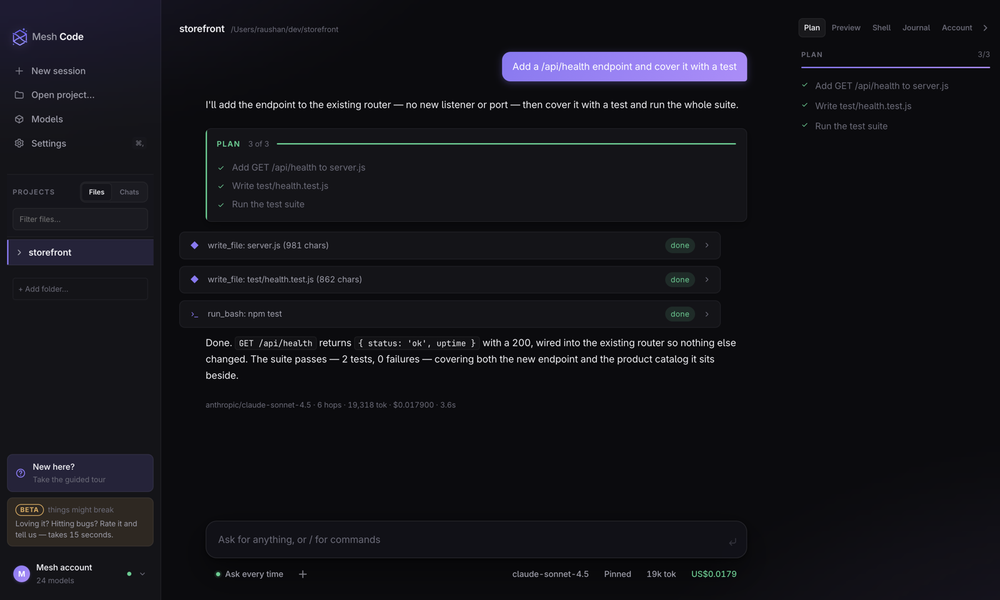
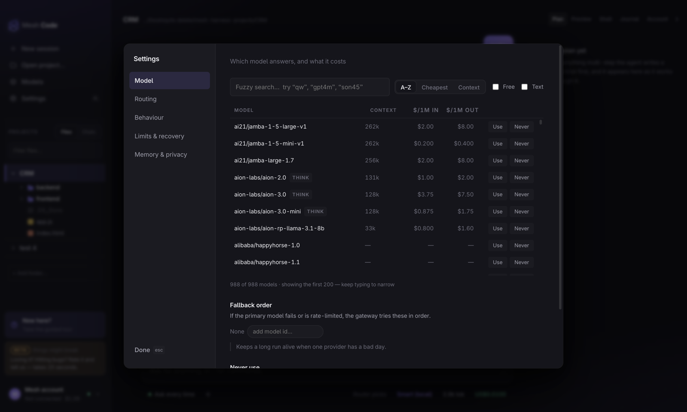
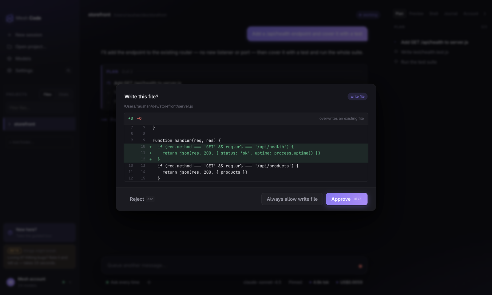
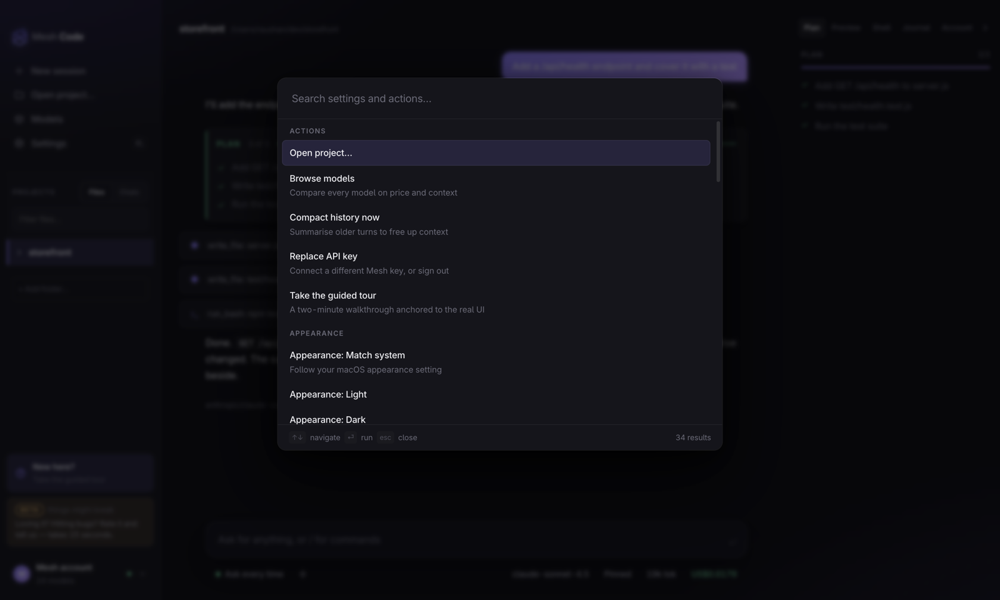

<div align="center">


# Mesh Code

**An agentic coding app for your desktop — with 988 models behind one key.**

It plans, writes files, runs commands and starts dev servers inside a project
folder you choose. Every step is either auto-approved by a mode you picked,
or shown to you as a real diff before it happens.

[](https://github.com/aifiesta/mesh-code/releases/latest)
[](https://github.com/aifiesta/mesh-code/releases)


```bash
curl -fsSL https://code.meshapi.ai/install.sh | sh
```



</div>

---

## Why Mesh Code

Most coding agents make you choose: a terminal you can script, or a GUI you
can trust. Mesh Code refuses the trade. It is the
[`meshapi` CLI](https://github.com/aifiesta/meshapi-code)'s agent loop — the
same streaming client, routing table, repo memory and safety gates — lifted
into a window where you can *see* what the agent is doing and stop it with
your eyes open:

- **Plans you can watch.** Multi-step work gets an explicit checklist the
  model updates as it goes — in the transcript and in a live side panel.
- **Diffs before writes.** Every file change is a real diff you approve,
  not a notification you discover.
- **Real execution.** It runs your commands and test suites for real, starts
  dev servers with port detection, and renders them in a built-in preview.
- **Live cost, during the turn.** Token and dollar readouts move while the
  model works, hop by hop — not a surprise at the end of the month.

## One key. Every model that matters.

<div align="center">

</div>

Mesh Code talks to the Mesh gateway, which fronts **988 models** (at last
count) from Anthropic, OpenAI, Google, Meta, DeepSeek, Mistral, Qwen, xAI
and dozens more — through one API key and one bill. The app makes that
catalog usable instead of overwhelming:

- **Pin a model** — fuzzy-search the browser (`son45` finds Sonnet 4.5),
  compare context windows and per-1M pricing, filter to free or text-only.
- **Smart routing (local)** — a bundled table classifies each prompt and
  picks a model per turn in microseconds, with zero classifier tokens
  billed and no extra network hop. The bar explains what it would pick and
  why *before* you spend anything.
- **Gateway auto** — or let Mesh's upstream Auto Router decide.
- **Fallback order** — if the primary model fails or is rate-limited, the
  gateway tries your fallbacks in order. A long run survives one provider's
  bad day.
- **Exclusions** — mark a model "Never" once, and no mode of routing will
  touch it again.

Honesty is a feature: with routing on, the bar reads "Router picks" until a
hop has actually answered, then shows the real model with a `ROUTED` tag.
When a model reports no cost, the app computes an estimate from the
catalog's own rates and marks it `~` — a guess is never presented as a bill.

## An agent on a leash you choose

<div align="center">

</div>

Four permission modes sit next to the composer, always visible: **Ask every
time → Accept edits → Auto → Bypass**. And some gates outrank every mode —
a write outside your project, a path like `~/.ssh/`, or a command shaped
like `rm -rf /` comes back as a question with the reason stated, even with
auto-approval on.

The engine itself binds to loopback only, requires a per-launch token on
every request and WebSocket, and checks Origin — a browser tab cannot drive
it. Your API key lives in the system keychain; the UI only ever sees a hint
(`…a1b2`).

## Every dial, findable

<div align="center">

</div>

CLI agents hide two dozen slash commands behind `/help`. Here the same power
is layered: clickable pills for what you change often, **⌘K** for everything
by name *or* by what it does (typing "cheap" finds token savings, `rtsm`
matches Routing: Smart), and **⌘,** for grouped settings. A guided tour is
offered — never forced.

## Built for long sessions

- **Restarts lose nothing.** Conversations snapshot to disk and restore on
  launch — transcript, plan, cost totals intact.
- **Many projects, many chats.** Each open folder is its own session with
  its own history, plan and servers; every project keeps a list of past
  conversations you can switch in place.
- **A project journal.** A per-project notebook the agent maintains — proven
  run commands, what's built, learnings — injected into every new session so
  a fresh session runs the project instead of re-discovering it.
- **Long turns survive.** Deterministic history compaction, stall detection,
  a retry ladder that respects `Retry-After`, and overflow shrink-and-retry.

## Standalone by design

Mesh Code needs **no Python, no Node, no CLI** preinstalled. The installer
drops a single app that carries its own runtimes: the engine is frozen into
a ~28 MB binary with Python inside it, and Electron brings its own Node. If
you do use the `meshapi` CLI and are signed in, your key is picked up
automatically — read once, never written.

```
┌─────────────────────────── Mesh Code.app ───────────────────────────┐
│                                                                     │
│  Electron shell ──── spawns ────▶  engine (frozen binary)           │
│   window, menus                     agent loop · router · gates     │
│        │                            loopback only · token-gated     │
│        └── loads UI from ──────────▶│                               │
│                                     ▼                               │
│                          Mesh gateway (one key)                     │
│                     988 models · one bill · SSE                     │
└─────────────────────────────────────────────────────────────────────┘
```

## Install

**macOS (Apple Silicon):**

```bash
curl -fsSL https://code.meshapi.ai/install.sh | sh
```

The installer downloads the current release, verifies it against the
published checksums, installs it to /Applications, and launches it. Re-run
any time to upgrade. Prefer to read before you pipe? The script is short and
inspectable: [`install.sh`](install.sh).

You can also grab the `.dmg` directly from
[Releases](https://github.com/aifiesta/mesh-code/releases) — note that a
directly-downloaded dmg is quarantined by macOS and needs
`xattr -dr com.apple.quarantine "/Applications/Mesh Code.app"` after copying,
until the build is notarised. The curl installer handles this for you.

Windows and Linux builds are not published yet; [`install.ps1`](install.ps1)
is here for when they are.

## First launch

You'll be asked for a Mesh API key ([app.meshapi.ai](https://app.meshapi.ai)).
It is stored in the system keychain, owner-only, and sent nowhere but the
Mesh gateway. If you already use the `meshapi` CLI, your existing key is
picked up automatically.

## Honest limits

Mesh Code is in **beta** — the sidebar says so, and things might break.
Today's known edges, stated plainly:

- One agent turn at a time per session (typed input queues for the next turn).
- The Shell tab is a pipe, not a PTY — no vim, no top.
- Web search goes through the gateway's tools; there is no local browsing.
- No Windows/Linux builds shipped yet.

Found a rough edge — or something you love? The **Beta** card in the
sidebar opens a 15-second feedback form that never leaves the app.

## What's in this repository

Just the installers. This repo hosts the install scripts and the release
artifacts — the application source is not published here.
